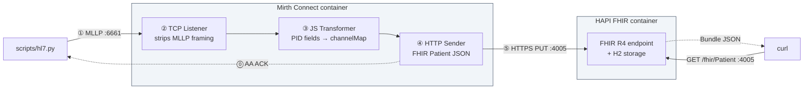

# HL7 v2 ↔ FHIR Integration Testbed

A reproducible local pipeline for learning how to troubleshoot HL7 v2 → FHIR integrations. The Python CLI sends MLLP-framed HL7 v2 messages into Mirth Connect, which transforms each one into a FHIR Patient resource and POSTs it to a HAPI FHIR R4 server. Every step is visible in Mirth's Message Browser — the same tool integration engineers use to debug production interfaces.

The full walkthrough (admin client install, channel build, troubleshooting playbook) lives in **[SETUP.md](SETUP.md)**. This README is the quick reference.

## System



| Host port | Container | Purpose |
|---|---|---|
| 6661 | mirth:6661 | MLLP TCP listener (the channel binds this) |
| 4005 | hapi-fhir:8080 | HAPI FHIR REST API |
| 4443 | mirth:8443 | Mirth admin HTTPS / REST |
| 4006 | mirth:8080 | Mirth admin HTTP |

The write path's last leg goes Mirth → `host.docker.internal:4005` → host → HAPI by design — there is **no** shared Docker network between the two containers. The read path (`curl` → HAPI) is direct host-to-container via the published port. See [SETUP.md → Architecture and data flow](SETUP.md#architecture-and-data-flow) for why.

## Quick start

```bash
# 1. Bring up Mirth + HAPI
docker compose up -d

# 2. Install the only Python dependency
pip install -r requirements.txt

# 3. (one-time) Configure the Mirth channel — see SETUP.md Steps 3–6.
#    Or import the exported channel definition:
#    mirth/channels/hl7v2-adt-to-fhir-patient.xml

# 4. Send your first message
python3 scripts/hl7.py send
```

You should see an `MSA|AA` ACK from Mirth. Verify the Patient landed in HAPI:

```bash
curl -s 'http://localhost:4005/fhir/Patient?family=Doe' | python3 -m json.tool
```

### Admin GUI (macOS, one-time)

Building or importing the channel (step 3 above) needs the Mirth Connect Administrator GUI. Install NextGen's **native launcher** — direct download for Apple Silicon:

```bash
curl -L -o ~/Downloads/mirth-admin-launcher.dmg \
  https://s3.us-east-1.amazonaws.com/downloads.mirthcorp.com/connect-client-launcher/mirth-administrator-launcher-latest-macos-aarch64.dmg
```

Mount it, drag the app into `/Applications`, then open `mirth-administrator.jnlp` with it (or add a connection to `https://localhost:4443/webstart` in the launcher). Intel build + full walkthrough: **[SETUP.md](SETUP.md) Steps 3–4**. Don't use OpenWebStart — it launches the client but fails to connect.

## CLI usage

`scripts/hl7.py` composes **three orthogonal axes**. Every combination produces a defined byte stream.

| Axis | Flag | Values | Default |
|---|---|---|---|
| Message type | `--message-type` | `adt-a01`, `adt-a03`, `adt-a08`, `oru-r01` | `adt-a01` |
| Patient source | `--patient` (or `--random` shorthand) + `--locale` | `canonical`, `random` | `canonical` |
| Error overlay | `--error` | one of the registered overlays (see below) | none |

### Subcommands

```bash
python3 scripts/hl7.py                  # prints help when called with no args
python3 scripts/hl7.py list             # show every option with one-line teaching descriptions
python3 scripts/hl7.py send [flags]     # send one message
python3 scripts/hl7.py send-all [flags] # send every error overlay in sequence
```

Add `--host` / `--port` to `send` or `send-all` to override the MLLP target (default `localhost:6661`). Add `--delay SECONDS` to `send-all` to control inter-message spacing (default `0.5`).

### Examples

```bash
# Canonical John Doe — same identifiers every run
python3 scripts/hl7.py send

# Faker-generated patient (locale-aware)
python3 scripts/hl7.py send --random
python3 scripts/hl7.py send --random --locale de_DE
python3 scripts/hl7.py send --random --locale ja_JP

# Apply a single error overlay
python3 scripts/hl7.py send --error bad-date            # silent corruption — Mirth says AA, HAPI gets empty birthDate
python3 scripts/hl7.py send --error no-pid              # transformer throws — see Mirth Errors tab
python3 scripts/hl7.py send --error no-mllp-frame       # no ACK at all — Mirth never sees the message

# Compose all three axes
python3 scripts/hl7.py send --random --locale de_DE --message-type adt-a08 --error pipe-in-name

# Soak: populate Mirth's Message Browser with one of every failure mode
python3 scripts/hl7.py send-all --delay 0.3
```

### Error overlays

Grouped by where in the pipeline the corruption surfaces:

| Name | Group | What it teaches |
|---|---|---|
| `missing-mrn` | bad-data | Empty PID-3 → empty identifier in FHIR URL |
| `missing-name` | bad-data | Empty PID-5 → Patient resource has no name |
| `bad-date` | bad-data | Non-v2 date format → `birthDate` extracted as `''` |
| `bad-gender` | bad-data | Unknown gender code → transformer falls back to `unknown` |
| `pipe-in-name` | bad-data | Unescaped `\|` in name — corrupts following PID fields |
| `no-pid` | structure | Missing PID segment — transformer throws |
| `no-msh` | structure | Missing MSH header — parser rejects |
| `wrong-line-endings` | transport | Segments joined with `\n` instead of `\r` |
| `no-mllp-frame` | transport | Raw HL7 with no VT/FS framing bytes |

The pedagogically interesting cases are the **silent-corruption** ones — `bad-date`, `bad-gender`, `pipe-in-name`. Mirth returns `AA` (Application Accept), HAPI happily stores the resulting Patient, and nobody notices the data is wrong until somebody queries it weeks later. The Message Browser → **Mappings** tab is how you catch these in practice.

## Repository layout

| Path | What it is |
|---|---|
| `scripts/hl7.py` | The CLI (single file, top-down: framing → patient → builders → overlays → CLI) |
| `requirements.txt` | One line: `faker` |
| `docker-compose.yml` | Mirth + HAPI services with the right ports, env vars, restart policy |
| `mirth/channels/hl7v2-adt-to-fhir-patient.xml` | **Authoritative** channel definition (export this; import after `docker rm`) |
| `mirth/source-transformer.js` | Documentation copy of the channel's JS transformer |
| `mirth/destination-template.json` | Documentation copy of the HTTP Sender's FHIR Patient body |
| `SETUP.md` | The full walkthrough — admin client install, channel build, troubleshooting playbook |
| `diagrams/` | Hand-authored SVG diagrams referenced from SETUP.md |
| `CLAUDE.md` | Context for AI coding agents working in this repo |

## See also

- **[SETUP.md](SETUP.md)** — the long-form tutorial; everything in this README is a condensed pointer into it
- **[CLAUDE.md](CLAUDE.md)** — invariants and conventions for anyone (human or AI) editing this repo
